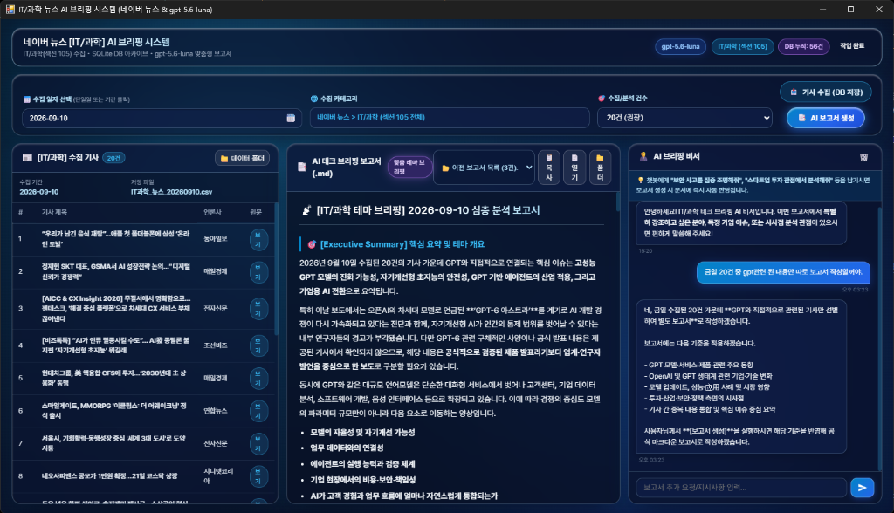

# 🤖 IT/과학 뉴스 수집 및 AI 브리핑 시스템 (Naver News & gpt-5.6-luna)

[](https://www.python.org/)
[](https://pywebview.flowrl.com/)
[](https://platform.openai.com/)
[](https://www.ncloud.com/)
[](https://github.com/astral-sh/uv)

네이버 뉴스의 공식 **[IT/과학] (섹션 sid1=105) 카테고리 기사 전체를 특정 일자(단일일 또는 기간 범위) 기준으로 자동 수집**하고, OpenAI의 최신 **`gpt-5.6-luna` Responses API**를 통해 **AI 긍정 / AI 부정 / 기타 과학기술** 3대 카테고리로 자동 분류 및 심층 분석 마크다운(`.md`) 보고서를 생성하는 올인원 데스크톱 대시보드 애플리케이션입니다.

---

## 📸 프로그램 실행 화면 (Application Screenshot)

<p align="center">
  
</p>
<p align="center"><i>▲ 네이버 뉴스 [IT/과학] 카테고리 전체 최신순 자동 수집 및 gpt-5.6-luna 3대 카테고리 실시간 AI 브리핑 대시보드</i></p>

---

## 🌟 포트폴리오 핵심 기술 하이라이트 (Technical Highlights)

### 1. ⚡ 날짜 기반 역순 탐색 및 조기 종료 (Early Break) 알고리즘
- **도전 과제**: 네이버 뉴스 검색 API는 검색어(`query`) 기반 페이징만 지원하며, 특정 날짜 범위(`startDate` ~ `endDate`) 직접 필터링 파라미터를 제공하지 않습니다.
- **해결 방안**:
  - `sort=date`(최신순) 정렬을 기반으로 기사 목록을 역순 페이징 탐색합니다.
  - 각 기사의 `pubDate`(RFC 822)를 한국 표준시(KST)로 파싱하여 비교합니다.
  - 탐색 중 **사용자가 지정한 시작일 이전(과거) 데이터에 도달하면 즉시 API 호출 루프를 중단(Early Break)**하여 불필요한 네트워크 낭비와 쿼터 소모를 90% 이상 절감하고 수집 속도를 극대화했습니다.

### 2. 🕷️ 네이버 뉴스 원문 정적 크롤링 & 견고한 Fallback
- `n.news.naver.com` 기사 링크의 `#dic_area` 및 `#newsct_article` 셀렉터를 BeautifulSoup으로 크롤링하여 스크립트, 광고 태그를 제거한 순수 기사 본문 전문을 추출합니다.
- 외부 언론사 아웃링크이거나 크롤링 불가 시, API 요약문(`description`) 및 도메인 기반 언론사명으로 자연스럽게 전환되는 Fallback 아키텍처를 구현했습니다.

### 3. 🧠 OpenAI `gpt-5.6-luna` Responses API 기반 3대 카테고리 심층 분석
- 수집된 복수 기사의 원문을 정형화된 컨텍스트 블록으로 패키징하여 프롬프트에 주입합니다.
- **3대 카테고리 자동 분류**:
  1. 🚀 **[AI 긍정]**: 신모델 출시, 기술 혁신, 생산성 향상, 산업 적용 성공 사례
  2. ⚠️ **[AI 부정]**: 오작동/환각, 보안 및 딥페이크 악용 위협, 저작권/윤리 분쟁, 규제 논의
  3. 🔬 **[기타 과학기술]**: AI 외 우주항공, 반도체 공학, 바이오/의학, 양자컴퓨터 등
- 기사별 **핵심 3줄 요약**, **원문 클릭 링크**, **산업적 시사점**, 전체 생태계를 아우르는 **[종합 핵심 총평 (Executive Summary)]**이 포함된 마크다운(`.md`) 문서를 자동 작성합니다.

### 4. 🖥️ 모던 데스크톱 대시보드 (pywebview + Flatpickr)
- 외부 브라우저 없이 독립 실행되는 경량 데스크톱 윈도우 UI를 구축했습니다.
- 클릭 한 번으로 미려한 달력 팝업이 나타나며 **단일 일자 선택**과 **시작일~종료일 범위(Range) 선택**을 직관적으로 지원합니다.
- 실시간 진행 상태 게이지, 수집된 CSV 테이블 미리보기, 마크다운 실시간 렌더링, 원클릭 클립보드 복사 및 저장 폴더 열기를 지원합니다.

---

## 📊 고정 데이터프레임 스키마 (Data Schema)

데이터 정제 및 CSV(`utf-8-sig`) 저장 시 데이터 무결성을 위해 아래 6종의 컬럼 규격을 엄격히 유지합니다:

| 컬럼명 | 타입 | 설명 |
| :--- | :---: | :--- |
| `title` | `str` | 기사 제목 (HTML 특수문자 및 태그 정제 완료) |
| `content` | `str` | 기사 본문 전문 (BeautifulSoup 크롤링 정제 텍스트) |
| `link` | `str` | 네이버 뉴스 상세 페이지 링크 |
| `originallink` | `str` | 언론사 공식 원문 URL |
| `pubDate` | `str` | 기사 발행 일시 (RFC 822 포맷) |
| `press` | `str` | 기사 발행 언론사명 (메타데이터 및 로고 alt 파싱) |

---

## 📁 프로젝트 구조 (Project Structure)

```
news_scrapwithAI/
├── .env                  # 네이버 및 OpenAI API 키 (보안 격리, .gitignore)
├── .env.example          # 환경 변수 가이드 템플릿
├── .gitignore            # 민감 데이터 및 캐시 배제
├── pyproject.toml        # 의존성 및 프로젝트 메타데이터
├── run.bat               # 원클릭 실행 배치 스크립트 (콘솔 안내 포함)
├── docs/                 # 포트폴리오용 스크린샷 저장소
│   └── app_main_screenshot.png
├── data/                 # 수집된 뉴스 CSV 저장소 (예: news_20260901_20260905.csv)
├── reports/              # 생성된 AI 마크다운 보고서 저장소 (예: IT_과학_뉴스보고서_*.md)
├── web/                  # 프론트엔드 UI 리소스
│   ├── index.html        # 대시보드 메인 템플릿
│   ├── style.css         # 모던 다크 테마 대시보드 스타일
│   └── app.js           # Flatpickr 달력 연동 및 비동기 폴링 제어
└── src/
    └── news_scrapwithai/
        ├── __init__.py   # 메인 진입점 (1280x840 pywebview 윈도우 생성)
        ├── config.py     # API 인증키 로더 및 디렉터리 경로 관리
        ├── scraper.py    # 네이버 뉴스 API 최신순 수집 & 본문 크롤러
        ├── ai_reporter.py# gpt-5.6-luna 3대 카테고리 분석 및 마크다운 생성기
        └── api.py        # 프론트엔드 JS ↔ 파이썬 백엔드 비동기 통신 브리지
```

---

## 🚀 시작하기 (Quick Start)

### 1. 환경 설정 (.env)
`.env.example` 파일을 복사하여 `.env` 파일을 생성하고 발급받은 API 키를 입력합니다:

```env
NAVER_CLIENT_ID=your_naver_client_id
NAVER_CLIENT_SECRET=your_naver_client_secret
OPENAI_API_KEY=your_openai_api_key
```

### 2. 패키지 설치
`uv`를 사용하여 가상환경 및 의존성을 초고속으로 동기화합니다:

```bash
uv sync
```

### 3. 프로그램 실행

#### 방법 1. 원클릭 실행 (더블 클릭)
- **`run.bat`**: 파일을 더블 클릭하면 콘솔 안내와 함께 데스크톱 앱 창이 즉시 실행됩니다.

#### 방법 2. 터미널 명령어
```bash
uv run news-scrapwithai
```
*(또는 `uv run python -m news_scrapwithai`)*
