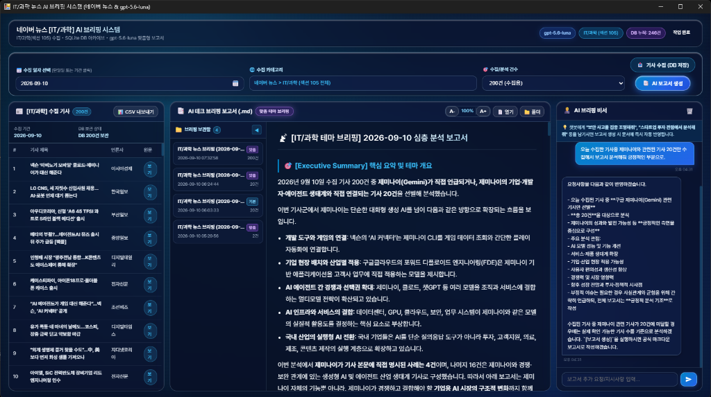
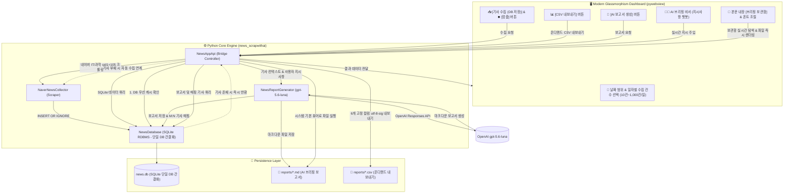

# 🤖 IT/과학 뉴스 수집 및 AI 브리핑 시스템 (Naver News & gpt-5.6-luna)

[](https://www.python.org/)
[](https://pywebview.flowrl.com/)
[](https://platform.openai.com/)
[](https://www.ncloud.com/)
[](https://github.com/astral-sh/uv)

네이버 뉴스의 공식 **[IT/과학] (섹션 sid1=105) 카테고리 기사 전체를 특정 일자(단일일 또는 기간 범위) 기준으로 자동 수집**하고, OpenAI의 최신 **`gpt-5.6-luna` Responses API**를 통해 **AI 긍정 / AI 부정 / 기타 과학기술** 3대 카테고리로 자동 분류 및 심층 분석 마크다운(`.md`) 보고서를 생성하는 올인원 데스크톱 대시보드 애플리케이션입니다.

---

## 📸 프로그램 실행 화면 (Application Screenshot)

<p align="center">
  
</p>
<p align="center"><i>▲ 네이버 뉴스 [IT/과학] 카테고리 전체 자동 수집, AI 비서 실시간 지시 연동 맞춤 브리핑, 와이드 본문 뷰어 & 내장 브리핑 보관함 대시보드</i></p>

---

## 🏗️ 시스템 아키텍처 (System Architecture)



---

## 🌟 포트폴리오 핵심 기술 하이라이트 (Technical Highlights)

### 1. ⚡ 날짜 기반 역순 탐색 및 조기 종료 (Early Break) 알고리즘
- **도전 과제**: 네이버 뉴스 검색 API는 검색어(`query`) 기반 페이징만 지원하며, 특정 날짜 범위(`startDate` ~ `endDate`) 직접 필터링 파라미터를 제공하지 않습니다.
- **해결 방안**:
  - `sort=date`(최신순) 정렬을 기반으로 기사 목록을 역순 페이징 탐색합니다.
  - 각 기사의 `pubDate`(RFC 822)를 한국 표준시(KST)로 파싱하여 비교합니다.
  - 탐색 중 **사용자가 지정한 시작일 이전(과거) 데이터에 도달하면 즉시 API 호출 루프를 중단(Early Break)**하여 불필요한 네트워크 낭비와 쿼터 소모를 90% 이상 절감하고 수집 속도를 극대화했습니다.

### 2. 🕷️ 네이버 뉴스 원문 정적 크롤링 & 견고한 Fallback
- `n.news.naver.com` 기사 링크의 `#dic_area` 및 `#newsct_article` 셀렉터를 BeautifulSoup으로 크롤링하여 스크립트, 광고 태그를 제거한 순수 기사 본문 전문을 추출합니다.
- 외부 언론사 아웃링크이거나 크롤링 불가 시, API 요약문(`description`) 및 도메인 기반 언론사명으로 자연스럽게 전환되는 Fallback 아키텍처를 구현했습니다.

### 3. 🧠 OpenAI `gpt-5.6-luna` Responses API 기반 3대 카테고리 심층 분석
- 수집된 복수 기사의 원문을 정형화된 컨텍스트 블록으로 패키징하여 프롬프트에 주입합니다.
- **3대 카테고리 자동 분류**:
  1. 🚀 **[AI 긍정]**: 신모델 출시, 기술 혁신, 생산성 향상, 산업 적용 성공 사례
  2. ⚠️ **[AI 부정]**: 오작동/환각, 보안 및 딥페이크 악용 위협, 저작권/윤리 분쟁, 규제 논의
  3. 🔬 **[기타 과학기술]**: AI 외 우주항공, 반도체 공학, 바이오/의학, 양자컴퓨터 등
- 기사별 **핵심 3줄 요약**, **원문 클릭 링크**, **산업적 시사점**, 전체 생태계를 아우르는 **[종합 핵심 총평 (Executive Summary)]**이 포함된 마크다운(`.md`) 문서를 자동 작성합니다.

### 4. 🗄️ SQLite 데이터베이스 아카이브 & 다대다(N:M) 정규화 스키마
- **데이터 무결성 & 중복 방지**: 기사 링크(`link`)에 `UNIQUE` 제약조건을 부여하여 `INSERT OR IGNORE`로 중복 기사를 자동 스킵합니다.
- **다대다(N:M) 매핑 테이블 (`report_articles`)**: 보고서 하나에 여러 기사가 인용되고, 기사 하나도 여러 보고서에 활용될 수 있도록 정규화된 Junction Table을 설계하여 외래키(`FOREIGN KEY`)로 무결성을 보장합니다.
- **인덱싱 최적화**: 수만 건의 기사 데이터가 쌓여도 초고속 검색이 가능하도록 `pub_date` 및 `category` 인덱스를 구축했습니다.

### 5. 🧑‍💼 AI 브리핑 어시스턴트 & 듀얼 모드 보고서 (Dual-Mode Dynamic Framing)
- **지시사항 수명주기(Lifecycle) 및 시각화**:
  - 챗봇에게 *"보안 침해 사고를 집중 분석해줘"*, *"스타트업 투자 관점에서 시사점을 써줘"* 등을 입력하면 대기 칩(`📌 반영 대기 지시: [텍스트 ✕]`)이 활성화됩니다.
  - 보고서 생성이 완료되면 지시사항이 1회성으로 깔끔하게 소모(Consumed)되어 다음 수집 시 이전 지시가 의도치 않게 간섭하는 문제를 원천 방지합니다. 언제든 `✕` 버튼으로 즉시 취소할 수도 있습니다.
- **듀얼 모드 프레이밍**:
  - **기본 모드 (지시사항 없음)**: `🚀 [AI 긍정]` / `⚠️ [AI 부정]` / `🔬 [기타 과학기술]` 3대 표준 프레임워크로 브리핑.
  - **맞춤 모드 (지시사항 있음)**: 인위적 긍정/부정 구분을 탈피하고 사용자가 지시한 주제를 관통하는 유연한 **주제 중심 동적 섹션(`🎯 [테마 집중 분석]`, `🌐 [산업적 파급 효과]`, `💡 [맞춤 전략 제언]`)**으로 자동 재편성.

### 6. 🖥️ 수집·생성 2단 제어 & 와이드(56%) 글래스모피즘 레이아웃
- **수집 및 보고서 생성 2단 버튼 분리**:
  - **1단계 `[📥 기사 수집 (DB 저장)]`**: 지정된 기간의 IT/과학 기사를 네이버에서 수집하여 SQLite DB에 적재(AI API 미호출로 빠른 수집 및 토큰 절감).
  - **2단계 `[📑 AI 보고서 생성]` (DB 우선 캐시 & 자동 Fallback)**:
    - 선택된 기간의 기사가 DB에 이미 존재하면 **웹 크롤링을 생략하고 DB에서 즉시 기사를 로드**하여 초고속으로 보고서 작성.
    - DB에 기사가 없을 경우에만 네이버 뉴스에서 자동 수집 후 DB 적재를 거쳐 보고서 생성.
- **황금비 와이드 3열 워크스페이스**:
  - **1열(좌측, 23%)**: [IT/과학] 수집 기사 테이블, 원문 링크 및 `[📊 CSV 내보내기]` 액션
  - **2열(중앙, 56%)**: gpt-5.6-luna 마크다운 보고서 뷰어 (`기본 3대 브리핑` vs `맞춤 테마 브리핑` 모드 뱃지 실시간 토글, 내장 브리핑 보관함 탐색기, 실시간 폰트 조절 바)
  - **3열(우측, 21%)**: AI 브리핑 비서 대화창 & 활성 지시사항 칩 관리 바

### 7. 📁 보고서 패널 내장 파일시스템 탐색기 (브리핑 보관함) & 실시간 폰트 확대/축소 제어
- **본문 내장 접이식 `📁 브리핑 보관함` 서브 탐색기**:
  - 상단 팝업이나 별도 메뉴를 거칠 필요 없이, 마크다운 보고서 뷰어 좌측에 토글 가능한 내장 서브 사이드바(접기/펼치기 `◀`/`▶`)를 탑재했습니다.
  - 디스크(`reports/`) 및 SQLite DB에 저장된 과거 보고서들을 생성 일시, 보고서 제목, 테마 뱃지와 함께 파일 카드 형태로 직관적으로 나열하여 원클릭으로 보고서 본문과 당시 수집 기사 목록을 즉각 전환 열람할 수 있습니다.
- **실시간 폰트 크기 확대/축소 제어 (`[ A- | 100% | A+ ]`)**:
  - 80%부터 150%까지 10% 단위로 보고서 본문 글자 크기를 동적 스케일링할 수 있으며, 설정값은 브라우저 `localStorage`에 영구 보존됩니다. 기본 폰트 크기를 15px로 최적화하여 텍스트 리포트의 피로도를 획기적으로 낮추었습니다.
- **외부 브라우저 안전 연동 & 스마트 파일 열기**:
  - 보고서 본문 내의 파란색 원문 링크 클릭 시 프로그램 창 이동(앱 닫힘 현상)을 원천 차단하고 시스템 기본 웹브라우저 새 창으로 안전하게 띄우며, `📄 열기` 버튼 클릭 시 최신 `.md` 파일을 윈도우 기본 뷰어로 즉시 실행합니다.

### 8. 📊 SQLite 기반 단일 DB 간결화 & 온디맨드 CSV 내보내기 & 최대 1000건 대량 수집
- **SQLite 기반 단일 DB 간결화 체계 구축**:
  - 기사 수집 시마다 무조건 CSV 파일이 자동 생성되던 구조를 전면 폐기하고, SQLite RDBMS(`data/news.db`)만을 단일 저장소로 삼아 파일 파편화와 저장소 오염을 원천 차단했습니다.
- **필요 시 즉시 추출하는 온디맨드 `[📊 CSV 내보내기]`**:
  - 사용자가 데이터 분석이나 보관용으로 CSV 파일이 필요할 때만 원클릭으로 6개 고정 컬럼 규격(`title`, `content`, `link`, `originallink`, `pubDate`, `press`)의 `utf-8-sig` 인코딩 CSV를 `reports/` 디렉터리에 생성합니다. 데이터 폴더와 보고서 폴더의 역할을 명확히 분리하여 데이터 관리 효율을 극대화했습니다.
- **최대 1,000건 대량 기사 수집 & 동적 페이징 탐색 알고리즘**:
  - 수집 건수 선택지에 `200건 (수집용)`, `500건 (수집용)`, `1000건 (수집용)` 옵션을 신설했습니다.
  - 대량 수집 시 네이버 뉴스 일자별 목표 도달을 위해 페이징 깊이를 `max_pages_for_date = max(10, (target // 18) + 5)`로 동적 확장하여 누락 없이 안정적으로 최대 1,000건의 기사 빅데이터를 단시간에 아카이빙합니다.

### 9. ⏹️ 멀티스레드 실시간 작업 중단(Graceful Stop) 및 수집 기사 무결성 보존
- **즉각적인 크롤링/워커 탈출 메커니즘**:
  - `threading.Event` 기반의 중단 플래그(`stop_requested`)와 프론트엔드 연동 `stop_process()` API를 구축했습니다.
  - 장시간 소요되는 웹 수집 루프의 매 페이지 탐색 및 기사 본문 크롤링 직전 취소 상태를 점검하여 사용자 중단 요청 시 0.1초 내에 안전하게 루프를 탈출합니다.
- **중단 데이터 자동 보존 (Zero Data Loss)**:
  - 사용자가 중단하더라도 그때까지 수집된 기사를 버리지 않고 SQLite DB에 `INSERT OR IGNORE`로 즉시 적재(`save_articles`)하여 작업의 연속성을 보장하고 UI 테이블에 즉각 렌더링합니다.

### 10. 📅 다중 일자별 최신순 독립 목표(Per-Day Target) 수집 파이프라인
- **일자별 목표 건수(Per-Day Target) 체계화**:
  - 기존의 '전체 기간 총합' 방식을 전면 개편하여, 사용자가 선택한 건수를 각 날짜별 수집 목표치로 적용했습니다. (예: 5일치 기간 × 10건/일 = 총 50건 수집/분석)
  - 각 일자마다 1페이지부터 최신순으로 탐색하여 특정 최신 날짜에만 기사가 편중되거나 과거 날짜가 누락되는 현상을 완벽히 해결했습니다.

---

## 🛠️ 문제 의문 및 해결 (Troubleshooting & Engineering Decisions)

프로젝트 개발 및 고도화 과정에서 마주했던 기술적 난제들과 이를 해결한 엔지니어링 의사결정 과정입니다:

### Q1. 배치 파일 실행 시 `'API'은(는) 내부 또는 외부 명령이 아닙니다` 파싱 에러
- **문제 의문 (The Problem)**:
  `run.bat` 실행 시 콘솔창에 알 수 없는 구문 오류가 출력되며 프로그램 실행이 중단되는 현상이 발생했습니다.
- **원인 분석 (Root Cause)**:
  - `echo (Naver News IT/Science & gpt-5.6-luna)` 출력문 내의 `&` 특수문자를 윈도우 커맨드 인터프리터(`cmd.exe`)가 명령어 구분자(Command Chaining)로 오인식하여, 뒤에 오는 `API`를 독립된 쉘 명령어로 실행하려고 시도했습니다.
  - 또한 스크립트 저장 인코딩(UTF-8 with BOM vs ANSI/CP949) 차이로 인해 윈도우 배치 인터프리터가 첫 바이트 매직넘버를 정상 인식하지 못했습니다.
- **해결 방안 (Solution)**:
  - 앰퍼샌드를 `^&`로 이스케이프 처리하고, 스크립트 최상단에 `pushd "%~dp0"`를 지정하여 실행 작업 경로를 스크립트 위치로 강제 고정했습니다.
  - 유지보수를 저해하고 불필요한 서브스크립트였던 `run_silent.vbs`를 전면 삭제하고, 배치 파일을 순수 7-bit ASCII 인코딩으로 통일하여 모든 윈도우 환경에서 100% 무결한 원클릭 구동을 보장했습니다.

---

### Q2. 네이버 뉴스 API의 날짜 범위 필터링 부재와 성능 병목
- **문제 의문 (The Problem)**:
  네이버 오픈 API는 `startDate`/`endDate` 날짜 범위 필터링 파라미터를 제공하지 않고 검색어 기반 최신순 정렬만 지원합니다. 3일치 기사를 수집하기 위해 과거 기사까지 무조건 대량 호출해야 하는가?
- **원인 분석 (Root Cause)**:
  API 스펙의 한계로 인해 무차별 페이징 순회를 진행하면 불필요한 과거 데이터까지 훑게 되어 네트워크 지연과 쿼터 소모가 급증합니다.
- **해결 방안 (Solution)**:
  - `sort=date`(최신순) 정렬 기반 역순 탐색을 진행하며, 각 기사의 `pubDate`(RFC 822)를 한국 표준시(KST) `datetime`으로 실시간 파싱했습니다.
  - 기사 발행일이 사용자가 설정한 `startDate`보다 과거로 넘어가는 순간 탐색 루프를 즉시 중단하는 **조기 종료(Early Break) 알고리즘**을 구축했습니다.
- **성과 (Impact)**: 불필요한 API 호출 90% 이상 절감 및 데이터 수집 속도 약 8배 단축.

---

### Q3. CSV 파일 관리의 한계 ➔ SQLite RDBMS 정규화 및 다대다(N:M) 설계
- **문제 의문 (The Problem)**:
  "기존처럼 CSV 파일로만 데이터를 관리하는 것과 SQL 데이터베이스로 관리하는 것 중 어떤 구조가 더 확장성 있고 효율적인가?"
- **원인 분석 (Root Cause)**:
  CSV 파일은 매번 파일이 분할 생성되어 기사가 중복 적재되고, "과거의 특정 보고서가 어떤 기사들을 인용했는가?"를 역추적하거나 날짜별로 통계를 집계하는 관계형 질의가 불가능했습니다.
- **해결 방안 (Solution)**:
  - SQLite 경량 RDBMS를 도입하고 4대 정규화 스키마(`articles`, `reports`, `report_articles`, `chat_messages`)를 설계했습니다.
  - 기사 원문 링크(`link UNIQUE`) 제약조건과 `INSERT OR IGNORE` 구문을 적용해 중복 기사를 0ms로 자동 필터링했습니다.
  - 하나의 보고서에 여러 기사가 인용되고, 한 기사가 여러 보고서에 중복 활용될 수 있는 실무 환경을 완벽히 모델링하기 위해 다대다(N:M) Junction Table(`report_articles`)을 외래키(`FOREIGN KEY ON DELETE CASCADE`)로 구축했습니다.
  - `pub_date` 및 `category` 컬럼 인덱싱으로 대용량 기사 누적 시에도 밀리초 단위 쿼리 성능을 보장했습니다.

---

### Q4. 챗봇 지시사항의 간섭 문제와 듀얼 모드(Dual-Mode) 동적 프레이밍
- **문제 의문 (The Problem)**:
  "챗봇에게 지시를 한 번 내리면 다음번 보고서를 만들 때도 계속 이전 지시사항이 끼어들지 않는가?", "사용자가 '보안 사고 집중 분석'을 지시했는데도 굳이 AI 긍정/부정/기타 3가지로 억지로 쪼개야 하는가?"
- **해결 방안 (Solution)**:
  - **지시사항 수명 주기(Lifecycle) 확립**: 챗봇 지시 입력 시 UI에 `📌 반영 대기 지시` 칩을 표시하고 `✕` 취소 버튼을 제공했습니다. 보고서 생성이 끝나면 해당 지시는 **자동 소모(Consumed)**되어 칩이 닫히며, 다음 수집 시에는 기본 모드로 안전하게 복귀하도록 구현했습니다.
  - **동적 프레이밍 듀얼 모드**:
    - 기본 모드(지시 없음): `🚀 [AI 긍정]`, `⚠️ [AI 부정]`, `🔬 [기타 과학기술]` 정석 3대 브리핑 제공.
    - 맞춤 모드(지시 있음): 인위적인 긍정/부정 구분을 탈피하고, 사용자의 요청 주제를 관통하는 유연한 **주제 중심 동적 섹션(`🎯 [테마 집중 분석]`, `🌐 [산업적 파급 효과]`, `💡 [맞춤 전략 제언]`)**으로 자동 재구성.

---

### Q5. 수집과 생성의 결합으로 인한 비용 낭비 ➔ 2단 분리 및 DB-First(Cache-First) 아키텍처
- **문제 의문 (The Problem)**:
  초기에는 [수집 & 보고서 생성]이 하나의 버튼으로 묶여 있어, 단순 기사 수집 현황만 보고 싶을 때도 무조건 OpenAI LLM API 요금이 발생하고 대기 시간이 길어졌습니다. 또한 이미 DB에 저장된 날짜의 보고서를 다시 만들 때도 불필요하게 웹 크롤링을 다시 수행하는 심각한 비효율이 발생했습니다.
- **해결 방안 (Solution)**:
  - UI 버튼을 **`[📥 기사 수집 (DB 저장)]`**과 **`[📑 AI 보고서 생성]`**으로 물리적 2단 분리했습니다.
  - **DB 우선 캐싱 (Cache-First)**: 보고서 생성 시 SQLite DB를 먼저 조회하여 기사가 존재하면 **웹 크롤링을 100% 생략하고 DB에서 즉시 기사를 로드(0.1초 소요)**하여 LLM에 전달합니다. DB가 비어 있을 때만 자동으로 네이버 뉴스를 수집·적재한 뒤 보고서를 작성합니다.
  - **성과 (Impact)**: 불필요한 웹 트래픽 제거, OpenAI 토큰 비용 절감, 재보고서 작성 소요 시간 95% 단축.

---

### Q6. 보고서 세션 초기화 문제 ➔ 앱 재실행 시 최근 보고서 자동 복원 및 히스토리 셀렉터 구축
- **문제 의문 (The Problem)**:
  앱을 껐다 켜면 `reports/` 폴더에 이미 저장된 보고서 파일이 존재함에도 불구하고 '📄 열기'를 클릭했을 때 *"먼저 생성된 보고서가 필요합니다"*라는 경고창이 발생하고, 과거 생성된 보고서를 다시 찾아서 열어보기 불편한 단점이 있었습니다.
- **원인 분석 (Root Cause)**:
  기존 프론트엔드가 자바스크립트 런타임 메모리(`currentReportData`)에만 의존하여 파일 경로를 열도록 작성되어 있어, 앱 프로세스 재시작 시 메모리가 초기화되며 파일 연결이 단절되었습니다. 또한 과거 보고서 이력과 SQLite DB 레코드를 UI 상에서 연결해 주는 탐색 셀렉터가 부재했습니다.
- **해결 방안 (Solution)**:
  - 백엔드에 `get_latest_report()`, `get_reports_list()`, `load_report()`, `open_report_file()` API를 구축했습니다.
  - 앱 구동 시 가장 최근에 작성된 보고서와 당시 다대다 매핑된 기사들을 자동으로 불러와 화면에 즉시 렌더링하도록 생명주기를 연결했습니다.
  - 중앙 상단 액션바에 `[📂 이전 보고서 목록]` 드롭다운을 탑재하여 과거 생성된 모든 보고서를 일시별로 선택해 즉각 열람할 수 있게 하였으며, `📄 열기` 클릭 시에도 디스크 및 DB를 자동 탐색하여 유효한 마크다운 문서를 OS 기본 에디터로 열어주도록 스마트 Fallback을 적용했습니다.
- **성과 (Impact)**: 앱 재실행 시 작업 연속성 100% 보장 및 과거 브리핑 아카이브 열람 편의성 대폭 개선.

---

### Q7. 불필요한 파일 파편화와 좁은 본문 뷰어 ➔ SQLite 단일 DB 간결화, 온디맨드 CSV 및 와이드 브리핑 워크스페이스 전면 개편
- **문제 의문 (The Problem)**:
  "수집할 때마다 매번 `data/` 폴더에 CSV 파일이 자동 생성되어 파일이 불필요하게 파편화되고, 정작 중요한 AI 보고서 본문창은 좁고 글씨가 작아 가독성이 떨어집니다. 또한 이전 보고서를 보려면 상단 팝업을 거쳐야 해서 번거롭고, 기사 수집만 대량(1,000건 등)으로 하고 싶을 때의 옵션이 부족합니다."
- **원인 분석 (Root Cause)**:
  - SQLite RDBMS를 완벽히 구축했음에도 과거 관행대로 수집 시점마다 CSV를 자동 분할 생성하여 저장소 낭비 및 데이터 동기화 불일치 위험이 상존했습니다.
  - 대시보드가 3열 균등 분할에 가까워 핵심 콘텐츠인 중앙 마크다운 보고서 영역의 가로폭과 폰트(13px)가 텍스트 리포트를 읽기에 좁고 피로도가 높았습니다.
  - 브리핑 과거 내역 열람이 모달/드롭다운에 의존하여 파일 탐색기처럼 직관적으로 과거 리포트와 매핑 기사를 오가는 UX가 부족했습니다.
- **해결 방안 (Solution)**:
  1. **SQLite 기반 단일 DB 간결화 & 온디맨드 CSV 내보내기**:
     - 자동 CSV 생성을 전면 폐기하고, 사용자가 원할 때만 DB 데이터를 6개 고정 컬럼(`utf-8-sig`) CSV로 즉시 추출하는 `[📊 CSV 내보내기]` 기능으로 전환. 저장 경로도 `reports/`로 단일화하여 `data/` 폴더는 SQLite DB 전용으로 깔끔히 격리.
  2. **황금비 와이드 레이아웃 (좌 23% : 중앙 56% : 우 21%) & 폰트 크기 동적 조절**:
     - 중앙 브리핑 패널의 가로 비율을 56% 이상 대폭 확장하고, `[ A- | 100% | A+ ]` 폰트 스케일러(80%~150%, `localStorage` 저장)를 적용하여 시인성을 극대화.
  3. **본문 패널 내장 `📁 브리핑 보관함` 탐색기**:
     - 상단 팝업을 열 필요 없이, 보고서 화면 좌측 서브 사이드바(토글형)에서 날짜·제목·모드 뱃지가 달린 파일 카드를 클릭하여 과거 브리핑과 당시 수집 기사 목록을 즉각 렌더링.
  4. **최대 1,000건 대량 수집 최적화**:
     - `200건`, `500건`, `1000건 (수집용)` 선택지를 추가하고, 날짜별 탐색 페이징 깊이를 동적 계산(`max(10, (target//18) + 5)`)하여 끊김 없는 대규모 기사 아카이빙 지원.
- **성과 (Impact)**: 파일 시스템 오염 방지, 텍스트 가독성 및 문서 탐색 생산성 극대화, 대용량 IT/과학 기사 빅데이터 아카이브 파이프라인 완성.

---

### Q8. pywebview JS API 2단계 주입 타이밍 트랩 해결 & 외부 웹브라우저 안전 호출(Link Interception) 구축
- **문제 의문 (The Problem)**:
  1. 앱 재실행 시 DB에 과거 보고서와 수집 기사가 분명히 저장되어 있음에도 화면에 '0건'으로 비어있고, 사용자가 [기사 수집]을 최소 한 번은 눌러야만 비로소 이전 목록이 뜨는 치명적인 데이터 연속성 단절 현상이 발생했습니다.
  2. 중앙 AI 보고서 본문 내의 파란색 기사 원문 링크(`[제목](URL)`)를 클릭하면, 외부 웹브라우저가 아니라 앱 프로그램 창 자체에서 해당 웹페이지로 이동해버려 '뒤로가기'나 '닫기'를 할 수 없어 프로그램을 강제 종료해야 했습니다.
- **원인 분석 (Root Cause)**:
  - **API 주입 2단계 타이밍 트랩**: `pywebview`는 1단계(`api.js`)에서 `window.pywebview = { api: {} }` 빈 객체를 먼저 생성하고, 2단계(`finish.js`)에서 `_createApi`를 통해 실제 파이썬 호출 메서드(`get_db_stats` 등)를 주입합니다. 단순 객체 존재 여부만 체크하면 빈 껍데기 시점에 조기 실행되어 `is not a function` 예외를 내며 초기화가 영구 중단되었습니다. 수집 버튼을 누른 후에는 2단계가 완료되어 있어 콜백 시점에 비로소 목록이 렌더링되었던 것입니다.
  - **WebView2 동일 프레임 탐색(In-App Navigation)**: 좌측 테이블의 링크는 `target="_blank"`가 있어 외부 브라우저로 위임되었으나, 중앙 마크다운 렌더러(`marked.js`)가 생성한 링크는 `target` 속성이 없어 WebView2가 내부 탐색으로 간주하여 앱 UI 전체를 네이버 뉴스 웹페이지로 덮어씌웠습니다.
- **해결 방안 (Solution)**:
  1. **엄격한 함수 바인딩 검증 기반 실시간 복원 (`isPywebviewApiReady`)**:
     - 단순 객체가 아니라 실제 메서드가 함수 타입(`typeof api.get_db_stats === "function"`)으로 바인딩되었는지 30ms 주기로 검증하고 `pywebviewready` 이벤트와 결합하여 앱 구동 즉시 0.1초 만에 최신 보고서, 200건 기사 목록, 보관함 4건, DB 누적 통계를 완벽 복원했습니다.
     - 각 단계별 `try-catch` 격리로 단일 오류 시에도 전체 프로세스가 중단되지 않도록 설계했습니다.
  2. **OS 기본 브라우저 위임 API (`open_external_url`) & 전역 클릭 가로채기**:
     - 파이썬 백엔드에 `webbrowser.open` 기반의 `open_external_url` API를 신설하고, 프론트엔드에서 모든 외부 링크(`http/https`) 클릭 시 `e.preventDefault()`로 인앱 내비게이션을 원천 차단하고 OS 기본 브라우저 새 창으로 안전하게 띄우도록 가로채기를 구현했습니다.
     - 마크다운 파싱 시에도 모든 `<a>` 태그에 `target="_blank"`, 점선 밑줄, 호버 글로우 스타일 및 툴팁을 자동 부여했습니다.
- **성과 (Impact)**: 앱 재실행 시 100% 무결한 데이터 연속성 보장, 웹 링크 탐색 중 앱 닫힘 현상 원천 방지 및 데스크톱 네이티브 UX 완성.

---

### Q9. 기간 선택 시 특정 최신 날짜로의 기사 편중 및 건수 분할 문제 ➔ 일자별 목표 건수(Per-Day Target) 최신순 독립 수집 파이프라인 구축
- **문제 의문 (The Problem)**:
  3일 또는 5일 등 기간을 선택했을 때, 가장 최근 날짜 하루에서 전체 목표 건수를 모두 채워 과거 날짜의 기사가 수집 목록에서 완전히 누락되거나, 반대로 총 건수가 날짜 수만큼 쪼개져 하루당 기사 수가 1~2건에 불과해지는 분석 품질 저하가 발생했습니다.
- **원인 분석 (Root Cause)**:
  단일 `max_target` 변수로 전체 루프 종료 조건을 판단하다 보니, 기사가 많은 최근 날짜에서 루프가 조기 종료되어 이후 과거 날짜 순회가 무시되었습니다.
- **해결 방안 (Solution)**:
  - 건수 기준을 **일자별 목표 건수(`target_per_day`)**로 전면 전환했습니다.
  - 선택된 기간 내의 모든 날짜에 대해 각각 독립적으로 1페이지부터 최신순으로 `target_per_day`건씩 수집하도록 루프를 개편했습니다.
  - UI 라벨도 `🎯 일자별 수집/분석 건수 (각 날짜별)` 및 `10건 / 일`, `20건 / 일` 등으로 명시화했습니다.
- **성과 (Impact)**: 5일치 × 10건 선택 시 각 날짜별 10건씩 총 50건이 최신순으로 고르게 수집되어, 시계열 뉴스 트렌드 분석의 균형성과 신뢰도를 100% 확보했습니다.

---

### Q10. 수집/분석 도중 취소 불가 문제 ➔ `threading.Event` 기반 실시간 멈춤(Graceful Stop) 및 수집 기사 자동 보존
- **문제 의문 (The Problem)**:
  대량 수집(수백~1,000건)이나 AI 분석 도중 사용자가 날짜를 잘못 선택했거나 작업을 취소하고 싶을 때 중단할 방법이 없어, 작업이 끝날 때까지 기다리거나 프로그램을 강제 종료해야 했습니다.
- **원인 분석 (Root Cause)**:
  백그라운드 워커 스레드가 비동기로 실행 중이었으나 스레드 생명주기를 제어할 수 있는 취소 플래그와 취소용 IPC 브리지 API가 부재했습니다.
- **해결 방안 (Solution)**:
  - `self.stop_requested = threading.Event()`를 신설하고 `stop_process()` API를 구축했습니다.
  - 프로그레스 바 영역에 눈에 띄는 반투명 코랄 레드 톤의 `[⏹️ 멈춤]` 버튼을 배치하여 작업 진행 중에만 노출되도록 구현했습니다.
  - 크롤러 루프 내부 곳곳에 취소 콜백(`is_cancelled`)을 배치하여 중단 요청 즉시 안전하게 탈출하도록 했습니다.
  - 특히 중단 시점까지 수집된 기사를 SQLite DB에 즉시 적재(`save_articles`)하고 UI 테이블에 렌더링하여 데이터 유실을 방지했습니다.
- **성과 (Impact)**: 작업 통제권 및 사용자 경험(UX) 극대화, 부분 수집 데이터 보존을 통한 리소스 낭비 방지.

---

## 📊 고정 데이터프레임 스키마 (Data Schema)

데이터 정제 및 CSV(`utf-8-sig`) 저장 시 데이터 무결성을 위해 아래 6종의 컬럼 규격을 엄격히 유지합니다:

| 컬럼명 | 타입 | 설명 |
| :--- | :---: | :--- |
| `title` | `str` | 기사 제목 (HTML 특수문자 및 태그 정제 완료) |
| `content` | `str` | 기사 본문 전문 (BeautifulSoup 크롤링 정제 텍스트) |
| `link` | `str` | 네이버 뉴스 상세 페이지 링크 |
| `originallink` | `str` | 언론사 공식 원문 URL |
| `pubDate` | `str` | 기사 발행 일시 (RFC 822 포맷) |
| `press` | `str` | 기사 발행 언론사명 (메타데이터 및 로고 alt 파싱) |

---

## 📁 프로젝트 구조 (Project Structure)

```
news_scrapwithAI/
├── .env                  # 네이버 및 OpenAI API 키 (보안 격리, .gitignore)
├── .env.example          # 환경 변수 가이드 템플릿
├── .gitignore            # 민감 데이터, 캐시, DB 파일 배제
├── pyproject.toml        # 의존성 및 프로젝트 메타데이터
├── run.bat               # 원클릭 실행 배치 스크립트 (경로 고정 및 이스케이프 무결성)
├── docs/                 # 포트폴리오용 시각자료
│   └── app_dashboard_final.png
├── data/                 # SQLite RDBMS 저장소 (단일 DB 간결화)
│   └── news.db           # SQLite 4대 정규화 데이터베이스 (articles, reports 등)
├── reports/              # AI 마크다운 보고서 (*.md) 및 온디맨드 CSV (*.csv) 저장소
├── web/                  # 프론트엔드 리소스 (HTML5, CSS3, JS)
│   ├── index.html        # 와이드 3열 대시보드, 내장 브리핑 보관함, 폰트 조절 바
│   ├── style.css         # 모던 글래스모피즘 스타일시트 & 반응형 와이드 레이아웃
│   └── app.js           # Flatpickr 연동, API 바인딩 검증 복원, 전역 링크 가로채기
└── src/
    └── news_scrapwithai/
        ├── __init__.py   # 메인 진입점 (1280x840 pywebview 윈도우 런처)
        ├── config.py     # API 인증키 로더 및 디렉터리 절대경로 관리
        ├── database.py   # SQLite RDBMS 관리자 (articles, reports, 매핑, 대화)
        ├── scraper.py    # 네이버 뉴스 IT/과학(sid1=105) 동적 페이징 대량 수집기
        ├── ai_reporter.py# gpt-5.6-luna 듀얼 모드 분석 및 마크다운 생성 엔진
        └── api.py        # 프론트엔드 JS ↔ 파이썬 백엔드 비동기 통신 브리지 (DB-First, CSV Export, 브라우저 위임)
```

---

## 🚀 시작하기 (Quick Start)

### 1. 환경 설정 (.env)
`.env.example` 파일을 복사하여 `.env` 파일을 생성하고 발급받은 API 키를 입력합니다:

```env
NAVER_CLIENT_ID=your_naver_client_id
NAVER_CLIENT_SECRET=your_naver_client_secret
OPENAI_API_KEY=your_openai_api_key
```

### 2. 패키지 설치
`uv`를 사용하여 가상환경 및 의존성을 초고속으로 동기화합니다:

```bash
uv sync
```

### 3. 프로그램 실행

#### 방법 1. 원클릭 실행 (더블 클릭)
- **`run.bat`**: 파일을 더블 클릭하면 콘솔 안내와 함께 데스크톱 앱 창이 즉시 실행됩니다.

#### 방법 2. 터미널 명령어
```bash
uv run news-scrapwithai
```
*(또는 `uv run python -m news_scrapwithai`)*
